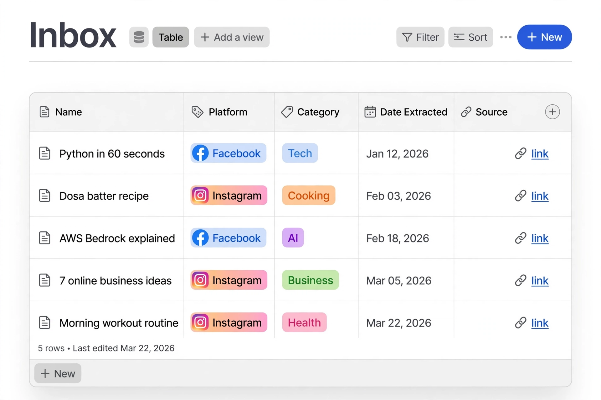
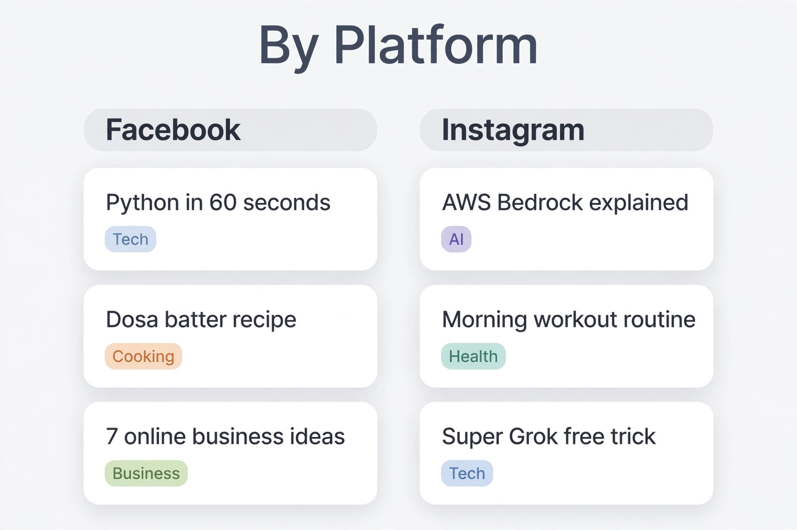
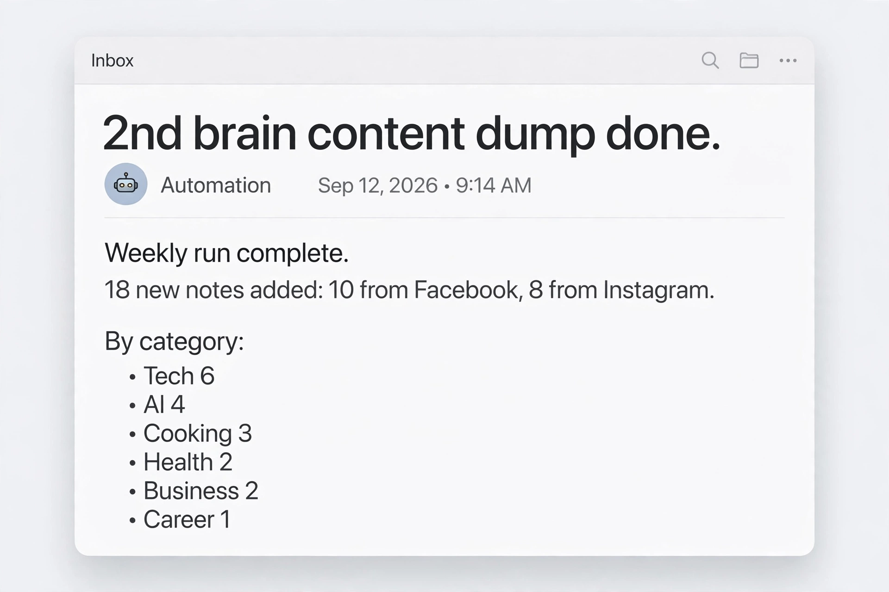
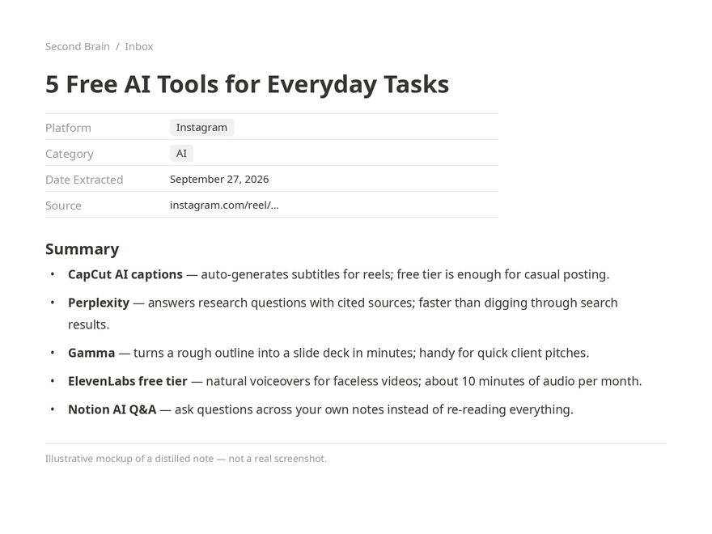

# Second Brain — Social Saves → Notion Vault (Automated)

> A personal knowledge system: everything interesting you save on Facebook and
> Instagram gets distilled into short, searchable notes in a Notion vault —
> automatically, every week. Nothing is ever deleted without your say-so.

You don't need to know how to code to understand or use this project. This
README explains everything in plain language.

---

## 1. What this project does (the 30-second version)

During the week you tap **Save** on interesting reels and posts on Facebook
and Instagram. Then, without you lifting a finger:

1. **Every Sunday**, an automated job collects everything new you saved,
   reads/watches each item, and writes a short note for it — a clear title plus
   3–8 bullet points capturing the useful part. Each note is filed in a Notion
   database called **📥 Inbox** and tagged with:
   - **Platform** — Facebook or Instagram
   - **Category** — Tech, AI, Cooking, Kids Learning, Health, Business,
     Career, Music, or Other
   - **Date Extracted** — the date the note was created
   - **Source** — the link back to the original reel/post
2. You get an **email confirmation** after every run, telling you how many
   notes were added (e.g. "12 notes: 7 Facebook, 5 Instagram").
3. **On the 1st of every month**, a second job reviews the vault and
   **suggests** notes that look stale, thin, or duplicated — grouped by topic.
   It only *suggests*. It never deletes, archives, or changes anything on its
   own. You decide what happens to each suggestion.

**The golden rule of this project:** nothing in the vault is ever deleted
without the owner's explicit confirmation. Ever.

---

## 2. Demo

A 44-second walkthrough of how the system works:

<video src="https://github.com/user-attachments/assets/2daf6ddc-396e-4821-aa96-74ab95208cc8" controls width="720"></video>

A quick look at the system in action. The four images below are illustrative mockups, not screenshots of a real vault — replace them with your own screenshots anytime (the how-to is right
underneath).

*The 📥 Inbox: every distilled note with its Platform, Category, Date
Extracted, and Source link.*

*The "By Platform" board view — Facebook notes in one column, Instagram in
another.*

*The email that arrives after every Sunday run: how many notes were added,
the Facebook/Instagram split, and per-category counts.*

*What a single note looks like: a distilled title, Platform/Category/Date
Extracted/Source properties, and 3–8 bullet points — never a full
copy-paste of the original post.*

### How to add your screenshots (no coding)

1. Take the screenshots: open your Notion vault and capture the Inbox table
   view and the By Platform board view; open any single note and capture it
   too; capture one weekly confirmation email from your inbox as well.
2. **Blur or crop out anything personal** — your name, email address,
   profile photos — using your phone's photo markup tool or any free image
   editor.
3. Save the four files with exactly these names:
   - `inbox-table.png`
   - `inbox-board.png`
   - `weekly-email.png`
   - `note-example.png`
4. On your GitHub repo page, open the `docs/` folder → **Add file → Upload
   files** → drag in the three PNGs → **Commit changes**.
5. Done — the images appear in the Demo section automatically, because the
   placeholder lines above already point at those file names.

## 3. The pieces (what's inside the system)

| Piece | What it is | Where it's documented |
|---|---|---|
| **Notion vault** | The knowledge base: one Inbox database + topic areas + an archive | `docs/vault-schema.md` |
| **Weekly pull** | The Sunday automation: fetch new saves → distill → file → email you | `docs/weekly-pull.md` |
| **Monthly review** | The 1st-of-month automation: find stale candidates, suggest cleanup | `docs/monthly-review.md` |
| **Dedupe tracker** | A small file remembering which items were already processed, so nothing is ever added twice | `docs/weekly-pull.md` (section 1) |

---

## 4. How to publish this on GitHub (click-by-click, no coding)

You can do all of this in your web browser. No terminal, no git commands.

### Step 1 — Create a GitHub account (if you don't have one)
1. Go to **https://github.com**
2. Click **Sign up** and follow the steps (email, password, username).
3. Verify your email address when GitHub asks.

### Step 2 — Create a new repository
1. Log in to GitHub and click the **+** menu (top-right) → **New repository**.
2. **Repository name:** `second-brain` (or any name you like).
3. **Description:** "Automated second brain: weekly Facebook/Instagram saves distilled into a Notion vault."
4. Choose **Public** (anyone can see it — good for a pet project/portfolio)
   or **Private** (only you). You can change this later.
5. Tick **Add a README file** — actually, *don't* tick it; you're about to
   upload your own README from this project.
6. Click **Create repository**.

### Step 3 — Upload these files
1. On your new repository page, click **uploading an existing file**
   (the link that says "uploading an existing file").
2. On your computer, open the folder containing this project's files
   (`README.md` and the `docs/` folder).
3. **Drag and drop** all of them into the GitHub upload area. Keep the
   folder structure: `README.md` at the top level, and the three `.md`
   files inside a folder named `docs/`.
4. Scroll down, write a commit message like `Add second brain project`,
   and click **Commit changes**.

That's it — your project is now on GitHub. GitHub automatically renders
`README.md` as the project's front page.

### Step 4 (optional) — Make it look nice
- **About section:** on the repo page, click the gear icon next to "About"
  and add a short description plus topics like `notion`, `automation`,
  `second-brain`, `productivity`.
- **Pin it:** on your GitHub profile, click **Customize your pins** and pin
  this repository so visitors see it first.

---

## 5. How to build your own version (the idea, in plain words)

If you (or a friend) want to recreate this system from scratch, these are the
steps in order. Each linked doc has the full details.

1. **Create the Notion vault.** Make a page called "Second Brain", add a
   database called "📥 Inbox" with the columns described in
   [`docs/vault-schema.md`](docs/vault-schema.md), plus a few topic pages
   under "Areas" and an empty "Archive". *(~15 minutes of clicking)*
2. **Connect your sources.** You need a way to read your Facebook saved
   items and Instagram saved posts. In this build that was done with
   command-line tools; a rebuild could use the official Notion API plus
   Meta's APIs, or a no-code tool like Make/Zapier. See
   [`docs/weekly-pull.md`](docs/weekly-pull.md) for exactly what data the
   job needs from each source.
3. **Set up the weekly job.** A scheduled task (cron) that runs the workflow
   in [`docs/weekly-pull.md`](docs/weekly-pull.md): fetch → distill → file →
   email. The doc contains the complete step-by-step logic.
4. **Set up the monthly job.** A second scheduled task running the workflow
   in [`docs/monthly-review.md`](docs/monthly-review.md).
5. **Protect the golden rule.** Whatever tools you use, make sure no step
   can delete or archive vault content without a human confirming the
   specific items first.

---

## 6. Important honesty notes (please read)

- **This repo documents the system; it doesn't run it by itself.** The live
  weekly/monthly automations in this build run on a personal AI assistant's
  scheduler using its built-in service connectors. Downloading this repo
  won't start fetching anyone's saved posts — and that's by design (it only
  ever touches *your* connected accounts).
- **Personal details have been removed.** Every email address, account
  handle, and internal ID in these docs is a placeholder like
  `your-email@example.com` or `YOUR_INBOX_DATABASE_ID`. Replace them with
  your own values when rebuilding.
- **No passwords or secret keys** are part of this project. All logins are
  handled by the connected services themselves.

---

## 7. FAQ

**Do I need to know programming to use this project as documented?**
No. Understanding it needs zero code. *Rebuilding* the automation on your
own would need either some coding or a no-code automation tool — section 5
above sketches both paths.

**Can I keep the GitHub repo private?**
Yes. Choose Private in Step 2, or change it later under Settings →
Danger Zone → Change visibility.

**What if a saved reel is deleted or has no transcript?**
The workflow covers that: deleted items become a short "unavailable" stub,
and items with no readable content are flagged **"rewatch to extract"** so
you know to open them manually. Nothing is ever made up.

**Why Notion?**
It's free, the database views (like the "By Platform" board) make the
collection browsable, and every note keeps a clickable source link back to
the original post.

**Can I add more categories later?**
Yes — the category list (Tech, AI, Cooking, Kids Learning, Health,
Business, Career, Music, Other) is just a starting set. Add what fits your
life.
